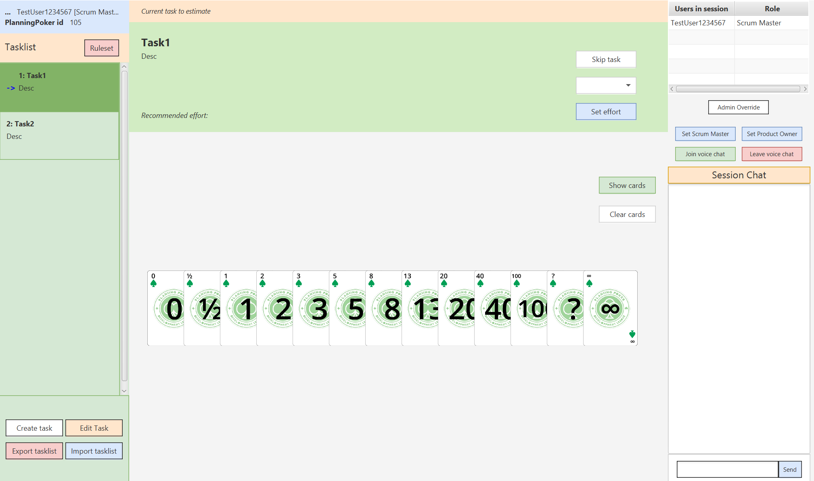

# Planning Poker

## Features
Developed in Java, using JavaFx, JSON format and File Persistence.

Features include:
1. Dashboard - Quickly track projects and maintain an overview.
2. Project Management functionality (Create/Read/Update/Delete)
3. Import/Export functionality, so projects can be exported as JSON and imported to other applications - or displayed on a webpage.
4. Settings - Customize the local experience.

## Video Showcase
https://github.com/user-attachments/assets/eb769530-56d5-470f-aee3-f6e3f48eb2f7

## Installation and Usage:
Please follow the instructions presented in the [Installation Manual](Development_Files/Bilag%20-%20Installationsguide.pdf)

## UML Use Case Diagram

## UML Domain Model

## Global Relations Diagram

## UML Class Diagram

