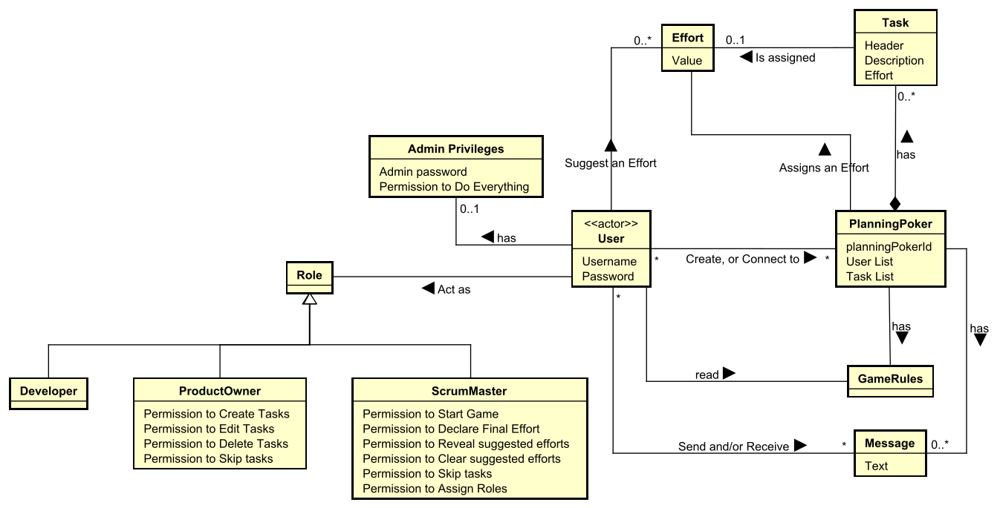
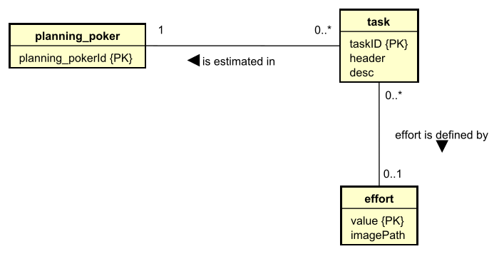

# Planning Poker

## Features
Developed in Java, using JavaFx, PostgreSQL, RMI, MVVM architecture and various design patterns, such as: Singleton, Adapter, Strategy & Observer patterns.

Features include:
1. Login and User creation functionality (unencrypted).
2. Planning Poker Session creation and management.
3. Support for multiple concurrent Planning Poker sessions with multiple concurrent roles and connected users.
4. Persistence - so planning sessions can be resumed.
5. Test chat.
6. Voice chat.
7. Interactive interface.

## Video Showcase
https://github.com/user-attachments/assets/eb769530-56d5-470f-aee3-f6e3f48eb2f7

## Installation and Usage:
Please follow the instructions presented in the [Installation Manual](Development_Files/Bilag%20-%20U%20Installationsguide.pdf) and the [User Guide](Development_Files/Bilag%20R%20-%20User%20Guide.pdf)

## UML Use Case Diagram

## UML Domain Model

## Global Relations Diagram

## UML Class Diagram

